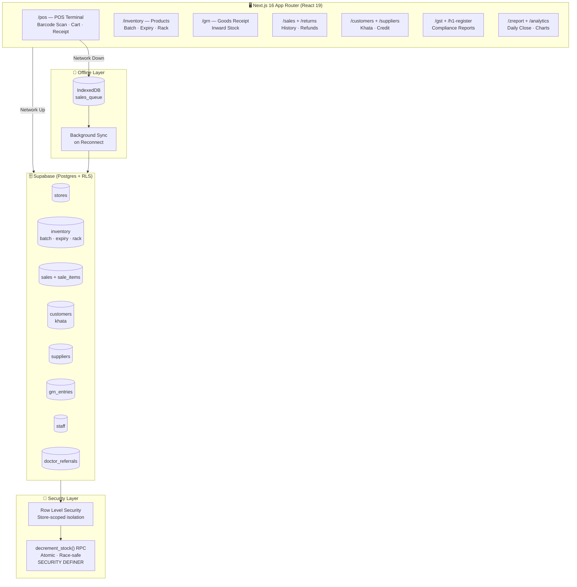

<div align="center">

# 🏪 ScanMart Partner

### Enterprise Retail & Pharmacy Management System

**Multi-Store · Offline-First · Pharmacy-Grade · GST-Ready**

[](https://nextjs.org/)
[](https://www.typescriptlang.org/)
[](https://supabase.com/)
[](https://tailwindcss.com/)
[](https://developer.mozilla.org/en-US/docs/Web/API/IndexedDB_API)
[](LICENSE)

> **An autonomous retail ecosystem** for India's kirana stores, pharmacies, and multi-outlet retailers — built with the billing speed of a POS terminal and the compliance depth of an ERP.

[**🚀 Live Demo → scanmart-app.vercel.app**](https://scanmart-app.vercel.app)

</div>

---

## 🎯 The Problem

India's retail and pharmacy sector runs on disconnected tools: a billing app here, a paper khata there, an Excel for GST, a WhatsApp note for reorder reminders. Small chains with 2–5 outlets have no affordable system that ties everything together.

**ScanMart Partner** is that system.

---

## ⚡ What's Inside

### 🏪 POS Terminal (`/dashboard/pos`)
- **Barcode scan-to-cart** via camera or handheld scanner (`html5-qrcode`)
- Numeric keypad optimized for tablet/touchscreen billing
- Multi-payment modes, discount percent, GST-inclusive pricing
- **Offline sale queuing** — power cut or no internet → sales don't stop
- Instant A5/thermal receipt generation (PDF via `jspdf`)

### 📦 Inventory Management (`/dashboard/inventory`)
- Bulk CSV import with column mapping (`pharmacy_import_v2.csv` format supported)
- **Pharmacy-grade batch + expiry tracking** — near-expiry alerts
- Pack/strip/tablet unit conversions (`supabase_pharmacy_units.sql`)
- Rack location tracking (`supabase_rack_tracking.sql`)
- Smart reorder thresholds — auto flags low-stock items
- Barcode label printing (`react-barcode`)

### 💊 Pharmacy Compliance
- **H1 Register** — Narcotic/Schedule H drug register (`/dashboard/h1-register`)
- **Doctor Referral Tracking** — links prescriptions to referring doctors
- Batch-level stock movements with expiry awareness

### 💰 Sales, Returns & Khata (`/dashboard/sales`, `/returns`, `/customers`)
- Full transaction history with receipt re-print
- Return/refund processing with stock reversal
- **Khata CRM** — credit tracking per customer (credit given / credit recovered)
- Supplier ledger management

### 📥 GRN — Goods Receipt Note (`/dashboard/grn`)
- Inward stock tracking linked to purchase orders
- Batch/expiry entry at GRN stage for pharmacy items

### 📊 Analytics & Reporting
- **Z-Report** (`/dashboard/zreport`) — daily closing report for accountants
- **GST Filing** (`/dashboard/gst`) — GSTR-ready output
- Revenue analytics with `recharts` visualizations
- Dead stock identification (products with `last_sold_at = NULL`)

### 👥 Staff & Settings
- Role-based staff management (`/dashboard/staff`)
- PIN-based session auth (no SMS OTP friction)
- Store configuration, tax rates, store logo

---

## 🏗️ System Architecture



---

## 🔐 Security Architecture

### Atomic Stock Decrement (Race-Condition Safe)

Every sale calls a **PostgreSQL RPC function** instead of a client-side UPDATE:

```sql
CREATE OR REPLACE FUNCTION public.decrement_stock(
  p_product_id uuid,
  p_quantity integer
) RETURNS void
LANGUAGE plpgsql SECURITY DEFINER AS $$
BEGIN
  -- Cross-store isolation: verify product belongs to caller's store
  IF NOT EXISTS (
    SELECT 1 FROM public.inventory i
    JOIN public.stores s ON s.id = i.store_id
    WHERE i.id = p_product_id AND s.owner_id = auth.uid()
  ) THEN
    RAISE EXCEPTION 'Access denied: product does not belong to your store';
  END IF;

  UPDATE public.inventory
  SET stock = stock - p_quantity, last_sold_at = now()
  WHERE id = p_product_id AND stock >= p_quantity;

  IF NOT FOUND THEN
    RAISE EXCEPTION 'Insufficient stock for product %', p_product_id;
  END IF;
END; $$;

-- anon users cannot decrement stock
GRANT EXECUTE ON FUNCTION public.decrement_stock(uuid, integer) TO authenticated;
REVOKE EXECUTE ON FUNCTION public.decrement_stock(uuid, integer) FROM anon;
```

**Why this matters:** Without this, two concurrent sales of the same last item could both succeed, causing negative stock. The RPC executes atomically at the database level — impossible to race.

### Row Level Security (RLS)
Every table is store-scoped. A logged-in user from Store A **cannot read or write** Store B's inventory, customers, or sales — enforced at the Postgres level, not the application layer.

---

## 📁 Project Structure

```
scanmart-partner/
├── app/
│   ├── auth/                   # Supabase auth flow
│   ├── login/                  # PIN-based login
│   ├── admin/                  # Admin panel
│   └── dashboard/              # Main app shell
│       ├── pos/                # POS Terminal
│       ├── inventory/          # Product management
│       ├── sales/              # Transaction history
│       ├── returns/            # Return processing
│       ├── customers/          # Khata / CRM
│       ├── suppliers/          # Vendor management
│       ├── grn/                # Goods Receipt Note
│       ├── h1-register/        # Pharmacy H1 log
│       ├── gst/                # GST filing
│       ├── analytics/          # Revenue charts
│       ├── zreport/            # Daily close report
│       ├── staff/              # Employee management
│       └── settings/           # Store configuration
│
├── components/
│   ├── POSCartTable.tsx        # Cart UI
│   ├── POSNumpad.tsx           # Touch numpad
│   ├── POSReceipt.tsx          # Receipt template
│   ├── BarcodeScanner.tsx      # Camera scanner
│   ├── Sidebar.tsx             # Navigation
│   ├── StoreSwitcher.tsx       # Multi-store switcher
│   └── PlanGuard.tsx           # Subscription gating
│
├── lib/
│   ├── supabase.ts             # Supabase client
│   ├── offlineDb.ts            # IndexedDB sales queue
│   └── AppContext.tsx          # Theme + Language (hi/en)
│
├── hooks/                      # Custom React hooks
│
└── supabase/
    ├── supabase_fixes.sql           # Core schema + atomic RPC
    ├── supabase_patch_v2–v4e.sql    # Versioned migrations
    ├── supabase_patch_v5_a5bill.sql # A5 receipt support
    ├── supabase_patch_v6_pack_volume.sql
    ├── supabase_grn.sql             # GRN tables
    ├── supabase_gst_filing.sql      # GST tables
    ├── supabase_h1_register.sql     # Pharmacy H1
    ├── supabase_khata_crm.sql       # Khata / credit
    ├── supabase_pharmacy_units.sql  # Unit conversions
    ├── supabase_rack_tracking.sql   # Rack locations
    ├── supabase_rls_security_fix.sql# RLS policies
    └── supabase_doctors_referral.sql# Doctor referrals
```

---

## 🌐 Offline Resilience

The POS **never stops working** during network failure:

```
Sale Attempt
     │
     ▼
  Network Available? ──Yes──▶ Supabase RPC (decrement_stock)
     │                              │
     No                         ✅ Done
     │
     ▼
  Queue to IndexedDB (sales_queue)
  Show "Saved Offline" badge on receipt
     │
     ▼ (on reconnect)
  Background Sync Worker
     │
     ▼
  Replay queued sales → Supabase
  Clear IndexedDB queue
```

Critical for India's retail environment where network cuts are common.

---

## 🌏 Multi-Language Support

- **Hindi / English** toggle (`AppContext.tsx`)
- Dark / Light theme persistence
- Built for Indian business workflows: GST, khata, GRN, H1 register — terminology that Indian shopkeepers actually use

---

## 📦 Tech Stack

| Layer | Technology |
|-------|-----------|
| Framework | Next.js 16 (React 19, App Router) |
| Language | TypeScript 5 |
| Styling | Tailwind CSS 4 + Framer Motion |
| Database | Supabase Postgres + Row Level Security |
| Auth | Supabase Auth (email + PIN session) |
| Offline | IndexedDB (`offlineDb.ts`) |
| Barcode | `html5-qrcode` + `react-barcode` |
| PDF | `jspdf` + `jspdf-autotable` |
| Charts | `recharts` |
| Icons | Lucide React |
| Deployment | Vercel |

---

## 🗄️ Database Setup

Run migrations in order inside Supabase SQL Editor:

```bash
# 1. Core schema + atomic stock RPC
supabase_fixes.sql

# 2. Sequential patches (run in order)
supabase_patch_v2.sql → v3 → v4 → v4b → v4c → v4d → v4e

# 3. Feature modules (any order after v4e)
supabase_grn.sql
supabase_gst_filing.sql
supabase_h1_register.sql
supabase_khata_crm.sql
supabase_pharmacy_units.sql
supabase_rack_tracking.sql
supabase_doctors_referral.sql
supabase_rls_security_fix.sql  # ← Run this LAST
```

---

## 🚀 Local Setup

```bash
# 1. Clone
git clone https://github.com/kuldeeppanwar02/scanmart-partner.git
cd scanmart-partner/scanmart-partner

# 2. Install
npm install

# 3. Configure
cp .env.example .env.local
# Fill in your Supabase URL and anon key

# 4. Setup database
# Run SQL files (see Database Setup above) in Supabase SQL Editor

# 5. Start
npm run dev
```

Open [http://localhost:3000](http://localhost:3000)

### Environment Variables

```env
NEXT_PUBLIC_SUPABASE_URL=https://your-project.supabase.co
NEXT_PUBLIC_SUPABASE_ANON_KEY=your-anon-key
```

---

<div align="center">

**Built for India's 63 million retail businesses.**

[Report Bug](https://github.com/kuldeeppanwar02/scanmart-partner/issues) · [Request Feature](https://github.com/kuldeeppanwar02/scanmart-partner/issues)

</div>

[README_scanmart_partner.md](https://github.com/user-attachments/files/31609128/README_scanmart_partner.md)
